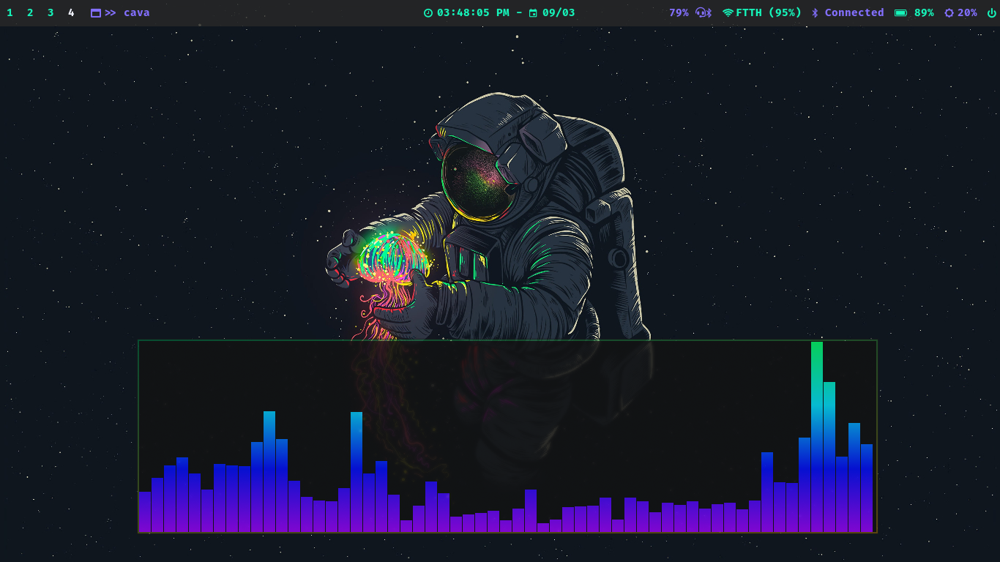

# README

This is the readme file for my dotfiles repo

## Screenshots



## Update Mirrors

```
sudo pacman -S reflector
```
```
sudo cp /etc/pacman.d/mirrorlist /etc/pacman.d/mirrorlist.bak
```
```
sudo reflector --latest 20 --protocol https --sort rate --save /etc/pacman.d/mirrorlist
```

## ZSH setup

Install zsh
```
sudo pacman -S zsh
```
Install oh-my-zsh
```
sh -c "$(curl -fsSL https://raw.githubusercontent.com/ohmyzsh/ohmyzsh/master/tools/install.sh)"
git clone https://github.com/zsh-users/zsh-autosuggestions.git $ZSH_CUSTOM/plugins/zsh-autosuggestions
git clone https://github.com/zsh-users/zsh-syntax-highlighting.git $ZSH_CUSTOM/plugins/zsh-syntax-highlighting
```

Configs are in *.zshrc*

#### To use custom prompt
```
git clone --depth=1 https://github.com/romkatv/powerlevel10k.git ${ZSH_CUSTOM:-$HOME/.oh-my-zsh/custom}/themes/powerlevel10k
```
Finally restart zsh
## How to replicate the dotfile in new system

Clone the repo
```
git clone --bare https://github.com/govtx86/dotfiles.git $HOME/.dotfiles
```
Add the alias (in zsh shell)
```
echo "alias dot='/usr/bin/git --git-dir="$HOME/.dotfiles/" --work-tree="$HOME"'" >> ~/.zshrc
```
Apply the dotfiles
```
dot checkout -f
```
```
dot config --local status.showUntrackedFiles no
```


## Programs

### Hyprland
```
sudo pacman -S hyprland base-devel kitty nemo rofi neovim firefox
```

The configs are in *.config/hpyr/hyprland.conf*

### Yay setup

```
git clone https://aur.archlinux.org/yay-bin.git
cd yay-bin
makepkg -si
```


### Essential Programs

```
sudo pacman -S polkit-kde-agent xdg-desktop-portal-hyprland dunst waybar hyprpaper gst-plugins-good gst-plugins-bad gst-libav gstreamer-vaapi cliphist grim slurp swaylock playerctl pavucontrol brightnessctl ttf-firacode-nerd
```
```
yay -S otf-font-awesome uxplay
```

### Additional Programs
```
sudo pacman -S htop neofetch
```
```
yay -S cava
```

For uxplay, start avahi daemon
```
sudo systemctl start avahi-daemon
sudo systemctl enable avahi-daemon
```

Set gtk dark theme
```
yay -S gnome-themes-extra adwaita-qt5-git numix-icon-theme-git
gsettings set org.gnome.desktop.wm.preferences theme "Adwaita-dark"
gsettings set org.gnome.desktop.interface gtk-theme "Adwaita-dark"
gsettings set org.gnome.desktop.interface icon-theme "Numix"
```
### Media apps
```
sudo pacman -S vlc gwenview
```
## Additional apps
- qbittorent - bittorrent client
- easyeffects - audio equaliser
- cava - audio visualiser

## Other system setups

### Bluetooth setup

```
sudo pacman -S blueman
```

Start and enable bluetooth
```
sudo systemctl start bluetooth.service
sudo systemctl enable bluetooth.service
```

### Fix wifi disconnected when laptop lid closes

Make a file */etc/systemd/system/lidbehaviour_override.service* (requires sudo)

Insert the following into the file
```
[Unit]
Description=Fix aeroplane mode on/off when lid opens/closes

[Service]
ExecStart=/usr/bin/setkeycodes e058 245 e057 245

[Install]
WantedBy=multi-user.target
```

Give the file execution permission
```
sudo chmod a+x lidbehaviour_override.service
```

Run/enable the service
```
sudo systemctl daemon-reload
systemctl start lidbehaviour_override.service
systemctl enable lidbehaviour_override.service
```

### Git setup
```
git config --global user.name "username"
git config --global user.email "email"
git config --global init.defaultBranch main
```
Github auth
```
sudo pacman -S github-cli
gh auth login
```
